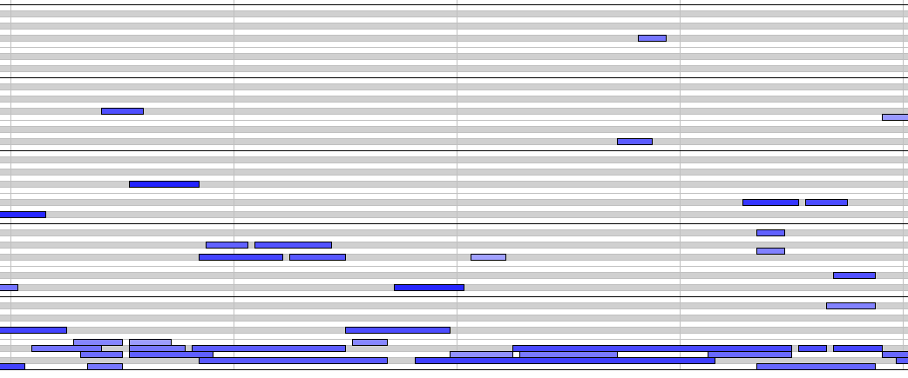
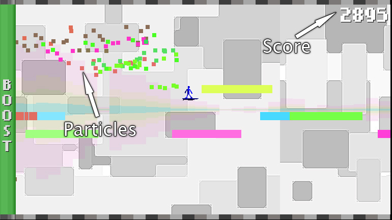
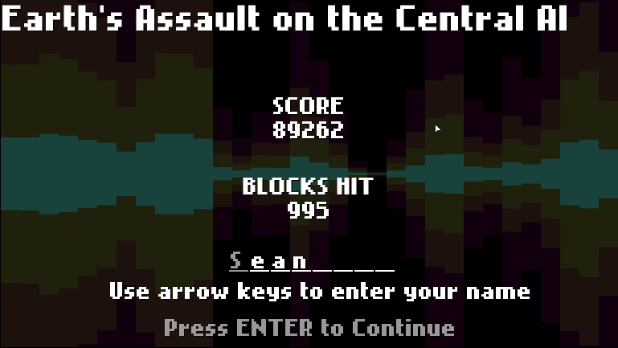
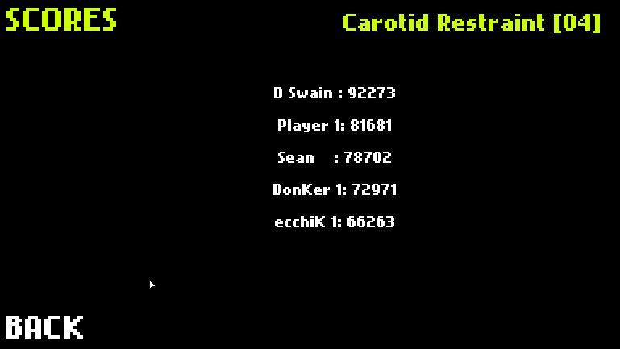

### Beat Boost

Beat Boost was conceived for Boing Boing's ["Games Inspired by Music" contest](http://boingboing.net/2010/06/14/games-inspired-by-mu.html). The contest was a call for games designed around chiptunes &mdash; a style of music inspired by the midi tunes of the games of yesteryear. I chose to take this rather literally and immediately began to look into using music tracks to generate the game world.

#### The Idea

When I started work on Beat Boost I planned for the game to be a 2D platformer/racing game, not unlike [Uniracers](http://en.wikipedia.org/wiki/Uniracers) on the SNES. The player would run through the level and have the ability to perform various tricks and stunts and chain these together. The ultimate goal was to achieve the highest score possible through a clever combination of stunts. There was also going to be a two player, split-screen race mode where two players would sit at a single computer a race for glory (and highscores).

The levels in the game are directly generated from that level's music. Doing this was a multistep process that produced a MIDI file that would be used to generate the level. The tool I used to transcribe each track into midi only took WAVs as input so each mp3 was first transcoded to WAV and then transcibed to MIDI. The resulting MIDI file could be charted to look something like this:

#### The Process

It's pretty easy to envision a platformer game when looking at the MIDI note chart. From here each MIDI was loaded into the game and parsed into a level, where I quickly ran into two problems with the platformer aspect of the game. The first was that none of the music tracks I was using were explicitly composed for a game so they don't loop well. Since each level was generated from the music track for that level the player would have to keep pace with the beat to complete the level before the track ended and in order to do this you have to move incredibly fast. So fast, that it was impossible to react to changes in the level at all.

The second problem was that the tracks I was generating the levels from where, again, not designed to be used in a game so there would be clusters of notes that would break the flow, gaps in the notes and just generally crappy levels. A lot of these issues could have been smoothed out but this takes us to another issue I had: time.

Though the contest lasted about a month I didn't start work on Beat Boost until there was about a week left. This short deadline forced me to cut a lot of features and constantly rework things so I could submit my game on schedule. Being a part-time, hobbyist game developer, this strict deadline was nice in that in forced me to push forward and work through problems rather than leave them for another day. The downside is that I needed to cut features like multiplayer that could have upped the fun factor of Beat Boost quite a bit.

The cutting began with the core of my original idea. The racing and platforming aspects of the game just were not coming together and the entire experience of playing the game could be summed up as "frustration" which is not a good then when you are going for "fun!" So I started looking at what the game was currently doing well and that turned out to be rapidly colliding with lots of blocks while listening to cool chiptunes. This is when I moved the game toward what it ultimately became: a sort of interactive particle generator (with highscores).

At this point Beat Boost was going to be a game where the player piloted a space ship of some sort through a field of blocks that replenished the ship's fuel and increased the player's score. Moving the ship around the screen consumed fuel so there would be a strategy to when and where the player should move the ship to maximize their score. Colliding with the bottom of the score would replenish fuel but deplete the player's score; hitting the top of the screen would just reduce the score. Anytime a block was hit it would shatter into a spray of smaller blocks that would trail the ship. Each of these blocks also gives the player fuel and points when collided with, though less than the larger blocks.

I had also redesigned the multiplayer mode to be a shared-screen racing mode but the race was now to collect the most points before crossing the finish line. This was the inspiration for having the large blocks shatter into smaller ones: there could be a strategy and "fight" between players to be out in front or to draft the leader. The smaller blocks would yield fewer points, but if played right you could achieve a higher score by staying back. The more desirable position would also change given the density of the blocks. With a high density of blocks it would pay to be in front since the front runner could hit more of the big point blocks than the drafter. In a lower density section it would pay to draft since there would be so many more small blocks than large. This positioning strategy based on block density dealt nicely with the fact that the levels would often have clumps of blocks or areas lacking many blocks. Unfortunately the multiplayer mode was axed entirely as I ran into the deadline.

Despite the fact that multiplayer was now out of the picture I had finally settled on the core mechanic of my game and the name "Beat Boost". The trick now was to really tweak the mechanic until it was as good as it could be. One issue with using the blocks as fuel was that the player had to constantly boost, depleting their fuel. I spent some time tweaking the values for how much fuel each block should give the player but always found that I’d give too little or two much. This was a particular problem because I had ceded control of my level design to an algorithm by generating the level from MIDIs so I couldn't (well I could, but it would have been time consuming at the least) tweak the design of the levels, which would have been another way to adjust fuel values.

In the end I decided that there needed to be a way the player could get a boost for free. To receive a free boost the player must hit the top half of a block with the bottom of his avatar. Doing this gives the player the tiniest, mini boost that can be sustained by hitting more blocks, with the end effect being similar to surfing a wave.

#### Aha!

The wave idea really brought things together for me. It was my AHA! moment. It lead me to ditch the space ship as player avatar for a little surfer dude and kick started the game's sound effects. Up until this point I hadn't put much thought into the sound effects for Beat Boost since the game was centered around music I didn't want a cacophony of sound overwhelming the musical aspect of the game. Embracing the surfing idea I created a nice, soft, soothing wave sound effect that plays anytime the player collides with a block. The only other sound effect used in the game is the "trick success" sound, a sound that plays whenever the player pulls of a trick.

Part of my original design for Beat Boost was to have a trick system where tricks could be combined for an ever increasing number of points. Due, again, to time constraints I didn't have time to create the animations for a bunch of tricks so I settled on a single trick, the front flip. The player is Beat Boost is controlled with the arrow keys, left and right move the player left and right; up boosts the player, using fuel; and down puts the player into a front flip, also using fuel.

While performing a front flip the player does not collide with blocks, thus fuel cannot be replenished. The reward for a successful front flip is 2,000 points, indicated by the "trick success" sound and a quick flash and scale of the player. If the player hit the ground up-side-down, mid flip he would be docked extra points in addition to the usual points that are deducted for riding the floor. Flipping was the last aspect of Beat Boost's gameplay mechanic. It introduced a nice risk/reward feature to the gameplay: you could use up extra fuel (now referred to as "boost") when riding through large clumps of blocks (now "beat blocks") and score more points than you would otherwise, but you couldn't acquire more boost while flipping and the penalty for mis-timing a flip negates any bonus.

#### Keeping Score

If you've been following along closely (you have right?) you'll likely have noticed that I've mentioned high scores and keeping score a number of times in this post. One of the original parts of Beat Boost's design was a high scores system meaning I needed some way to store scores and display them back to players.

Since Beat Boost is a browser-based web game it made a lot of sense to keep everything in one central location. This was accomplished with a MySQL database, some PHP and AMF, all of which is a topic for another post the main point being that I had a central, remote location where all scores could be quickly posted and retrieved. There is certainly no shortage of online leaderboards for this sort of thing but I wanted to avoid one thing in particular: yet another account for some web site you may or may not ever visit again.

Beat Boost is a one-off game for a contest and I didn't want to diminish one of the game's strengths by putting a sign-up barrier in front of users. I was also running out of time and coding a sign up and login system is never appealing. Fortunately the arcades of my youth offered a precedent here, I could simply take the user's name and transmit that along with the score and level name to my server to be saved in a high scores database. This method has the benefits of being technically simple and super fast and account free for players.

All that was required of players was that they complete a level, then enter their names old school style by using the keyboard's arrow keys and cycling through the alphabet (both lowercase and capital letters along with numbers). Once this was done hitting enter submits the score and takes the player to the next level. The name the player entered is also saved so it only has to be entered once.

To see the scores for a level players could click "Scores" on the main menu, then choose the level they were interested in to see the top five scores for that level.

I decided to only show the top five because that is what would fit on a single screen and I didn't have time to write any scrolling functionality into the scores view.

#### Finishing Touches

With all the gameplay and scoring complete all that was needed was some finishing touches. This included making a help view to explain the game concept and display the controls, a credits view to give props to everyone involved in the project, the HTML page in which the game SWF was embedded and the games user interface.

The help page and credits are super straightforward. Help has a two paragraph explanation of how to play Beat Boost with the control buttons listed below that. Credits is a list of all the roles and the person who filled said role. The credits list was particularly easy because it was just me and [Tettix](http://tettix.net/), the musician who wrote all the music used in Beat Boost. The HTML page was simply a black background that had "Beat Boost" across the top, the game in the middle of the page and the controls listed on the bottom of the page.

This leaves me with the UI. Since Beat Boost is meant to recall games of the 80s I felt a visually simple UI suited the game well. That said I wanted the interface to be interesting and lead players along nicely. What I ended up with is a simple list of all the actions a player can take from the main menu: Play, Scores, Help, and Credits. Each item in the main menu changes to a different color when moused over (pink, yellow, green and blue, respectively). When clicked on the item retains the rollover color, scoots across the screen to the upper left corner and fades in the appropriate content. When clicked back, the current content hides itself and the main menu label animates back to it's main menu position before the rest of the main menu fades in.

These last few touches are, for the most part, simple, simple stuff that really do a lot of improve the appearance of Beat Boost as a finished product. The UI is fairly simple as well, but that is more a case of the aesthetic of Beat Boost being simple 8-bit type stuff and UIs for more ambitious games are certainly anything but simple. Simpleness of the UI aside I feel like it does a great job of what it's supposed to do: display stuff the player clicks on.