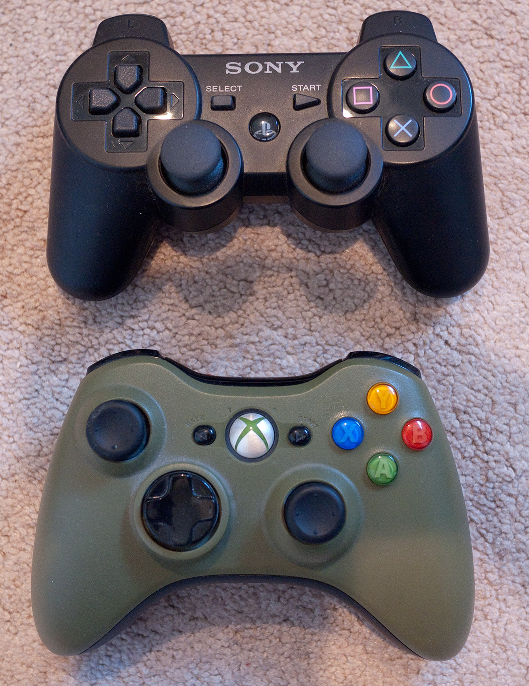
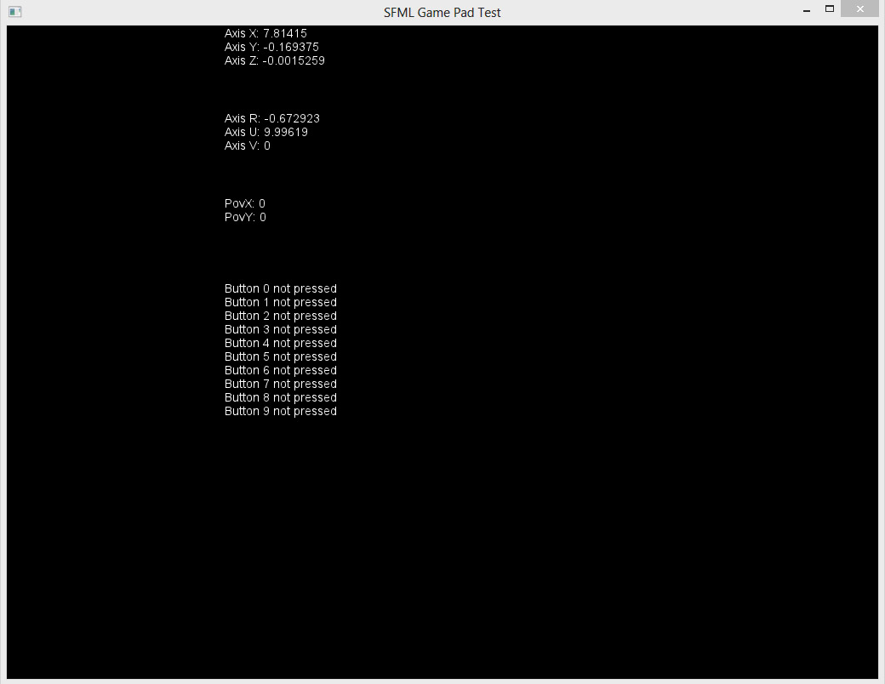

### SFML Gamepad Test

#### *A simple testbed application for gamepads in SFML*

 
Early this year I started using [SFML](http://sfml-dev.org/) as I wanted to dip my toes into game development with C++. I picked it over SDL and other popular C++ frameworks because it had a clean, object-oriented API that I felt comfortable with coming from an AS3 background, it had current documentation written by the author of the framework, and it had all (or most) of the features I wanted. As it's open source I can add features I need that vanilla SFML may be lacking.

With SFML you get joystick (of which gamepads like the Xbox 360 controller and Dual Shock 3 are examples) support out of the box. This is actually one of my killer features as a fair number of my game ideas are best played with a gamepad. While the [SFML Joystick API](http://sfml-dev.org/tutorials/2.0/window-inputs.php) is easy to use it does not provide a way to map button indexes to physical buttons. A simplified version of how the Joystick API works in SFML is that you ask "is the button at index 1 down?". SFML doesn't know the physical label of the button on your gamepad, rather it knows it by a numeric index. So, "index 1" may correspond to the physical button "Y", or it may correspond to the physical button "B", or it may correspond to something else entirely. This becomes a problem because, as a developer, there is no rhythm or reason to how buttons are mapped to indexes -- there's no way to reliably provide sane defaults. A picture will help here:

At the top is the PlayStation 3 Dual Shock 3 pad. At the bottom is the Xbox 360 controller. The analog sticks have a slightly different configuration but both controllers have the same number of buttons and sticks in roughly the same places. Physically the controllers are essentially interchangeable, however, when it comes to the SFML API this is not necessarily the case.

Physically the 360 pad's Y button corresponds with the PS3 pad's Triangle button. In SFML the corresponding index for the 360's Y button might be 1 while the PS3 pad's Triangle button may have an index of 2. To be clear, this isn't a shortcoming of SFML, it's just using what the controller's driver gives it. It does make it difficult to know which button on any given gamepad corresponds with which index in SFML. This is where SFML Gamepad Test (horrible name, sorry) comes in.

[SFML Gamepad Test](https://github.com/NoobsArePeople2/SFMLGamepadTest) is a simple SFML app that displays the axes and buttons for up to four connected gamepads. Using this app you can see which physical buttons correspond with which indexes in SFML and which axes correspond with which analog sticks.

On a related note, SFML Gamepad Test will only get you partway there with button mappings. Something SFML lacks is a way to uniquely identify a type of controller, for instance, a "getName()" function. [My branch of SFML](https://github.com/NoobsArePeople2/SFML) has implemented a "getName()" function on SFML's Joystick class for Windows and Mac if this is a feature you need in your life. Being able to identify a controller by name allows you to inspect the controller's name and load up pre-configured button mappings for the best possible user experience.