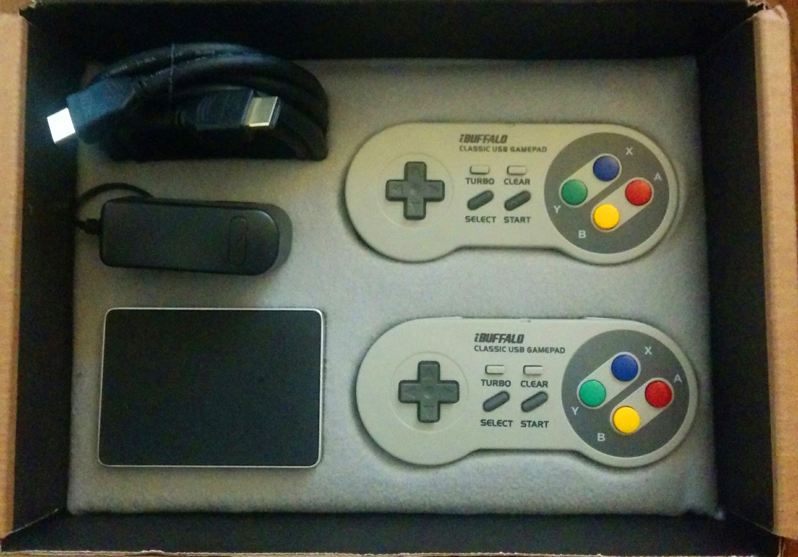
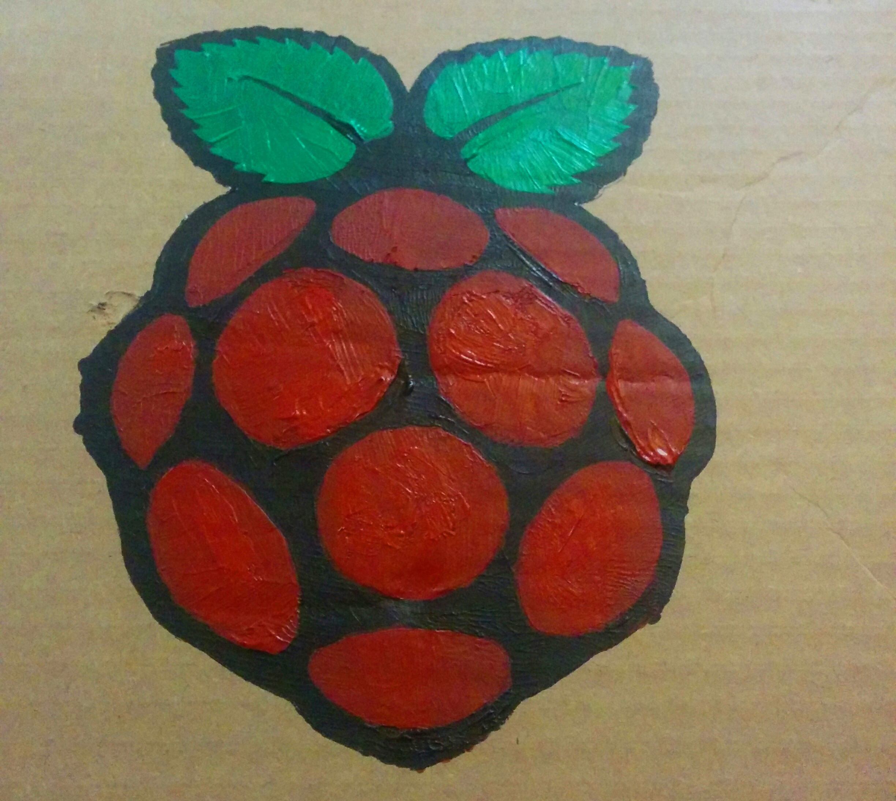
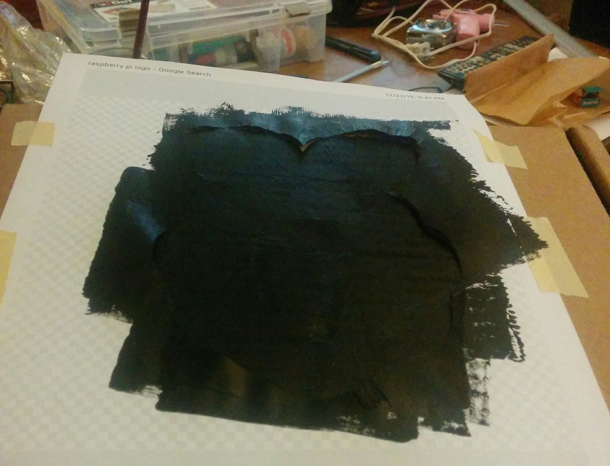
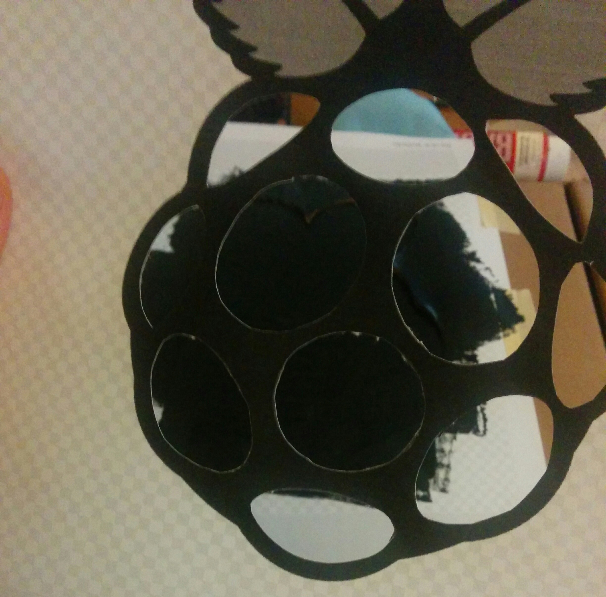
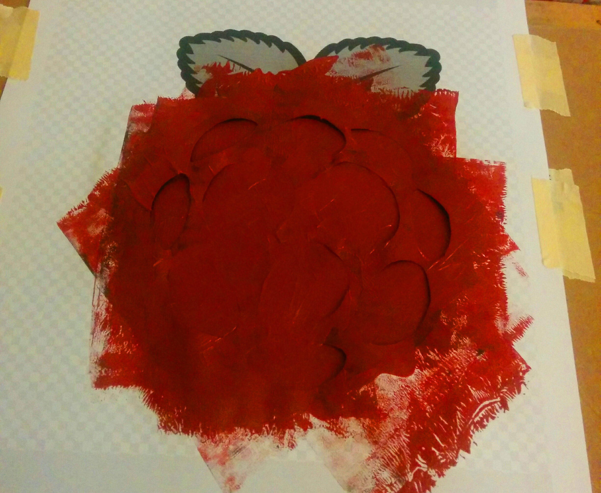
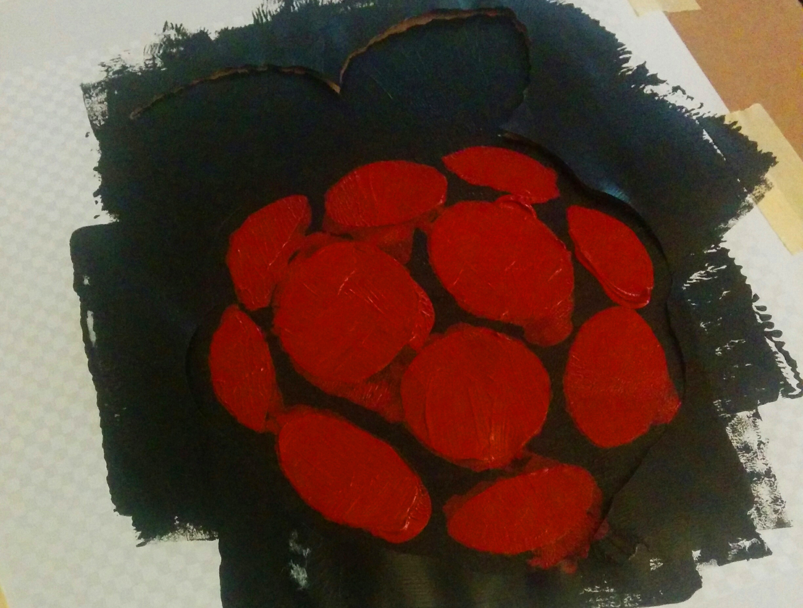
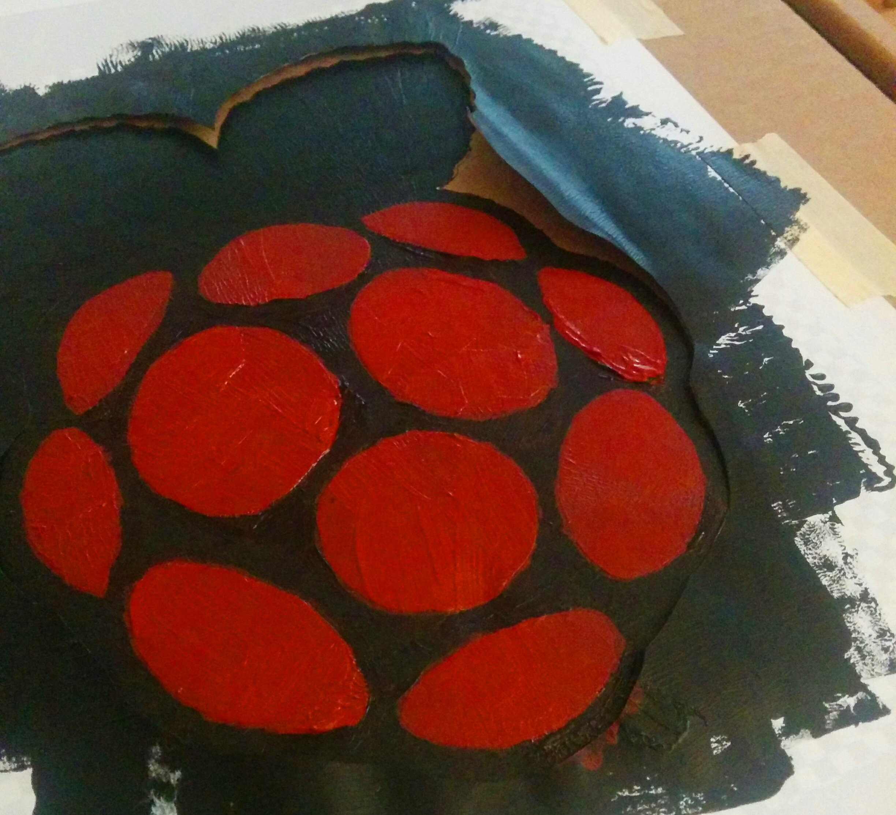
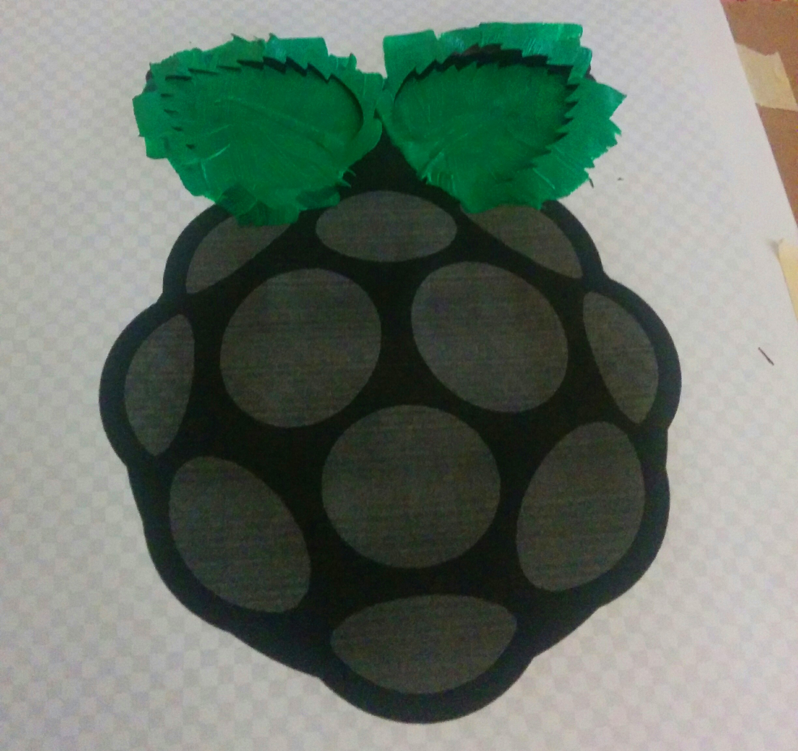

## RetroPie Emulator

For the family secret Santa this past Christmas I drew my brother and decided to make him something to harken back to the Christmases of our childhoods. We loved playing games and had both a Genesis and SNES but Christmas was one of the few times each year we added some new games to our collection (birthdays being the other reliable game acquistion dates) so this year I built him a Raspberry Pi based emulation machine running the RetroPie image.

I won't delve into the details of setting up the Pi and installing RetroPie as [Lifehacker](http://lifehacker.com/how-to-turn-your-raspberry-pi-into-a-retro-game-console-498561192) has an excellent article on the topic. I _do_ want to show of the packaging I made to house the Pi and controllers. But first, here's my complete parts list in case you look at this and want to make one of your own:

- [Raspberry Pi 2 Model B](http://www.amazon.com/gp/product/B00T2U7R7I?psc=1&redirect=true&ref_=od_aui_detailpages00)
- [Flirc Raspberry Pi 2 and B+ Case](http://www.amazon.com/gp/product/B00QB6F9I0?psc=1&redirect=true&ref_=od_aui_detailpages00)
- [CanaKit Raspberry Pi 2 Power Adapter](http://www.amazon.com/gp/product/B00MARDJZ4?psc=1&redirect=true&ref_=od_aui_detailpages00)
- [32GB MicroSD Card](http://www.amazon.com/gp/product/B010Q57T02?psc=1&redirect=true&ref_=od_aui_detailpages00)
- [Buffalo Classic USB Gamepad (x2)](http://www.amazon.com/gp/product/B002B9XB0E?psc=1&redirect=true&ref_=od_aui_detailpages00)
- You'll also need an HDMI cable to connect the emulator to your TV but any ol' HDMI cable should do.

Most of the flavor comes from the replica Super Famicom gamepads and they work well with RetroPie. There are also [Genesis](http://www.amazon.com/gp/product/B00KX75UT6?keywords=genesis%20usb%20controller&qid=1453592548&ref_=sr_1_1&sr=8-1), [NES](http://www.amazon.com/gp/product/B002YVD3KM?keywords=nes%20usb%20controller&qid=1453592560&ref_=sr_1_1&sr=8-1) and [N64](http://www.amazon.com/gp/product/B008L3UUPS?keywords=n64%20usb%20controller&qid=1453592567&ref_=sr_1_1&sr=8-1) replica gamepads out there to be had. No idea how well any of them work but having the SNES pad for SNES games is really nice.

If you want to spice things up even more and have access to a 3D printer the [Nintastic](http://www.thingiverse.com/make:156344) case looks really sweet. They're also available on [Etsy](https://www.etsy.com/listing/216145861/3d-printed-nintendo-raspberry-pi-case?ref=unav_listing-other) if you can wait 4-6 weeks. Unfortunately I do not have access to a 3D printer and I started this project a with less than 4 weeks to Christmas so I went with the Flirc case as it's sturdy and unobstrusive looking.

Anyone can buy all this stuff, follow the Lifehacker instructions and have a working emulator with a few hours effort. Since this was a Christmas gift I wanted to go the extra little bit to make this gift unique. I did that by making a special purpose case to hold the Raspberry Pi, power adapter, HDMI cable and two SNES-shaped controllers. The end result is below.

Sadly, I did not take any pictures during the making of the interior. It's all cardboard cut with a box cutter for the big cuts and an xacto knife for the finer details. Hot glue was used to keep the felt in place and fix support beams on the bottom of the case. To keep the controllers and the Pi from falling out of place and rattling around the bottom of the box they each have an internal platform for support.

While I can't show you the process for building the inside of the case I can show you the steps I took in stenciling the Raspberry Pi logo on the exterior. For the painting I used acrylic paints I had in the garage and made stencils with a [png of the Raspberry Pi logo](https://upload.wikimedia.org/wikipedia/en/thumb/c/cb/Raspberry_Pi_Logo.svg/810px-Raspberry_Pi_Logo.svg.png), a laser printer and an xacto knife. I printed out three copies of the logo on letter sized paper.

With the first copy I used my xacto knife to cut out around the edge of the entire logo. I used this to paint the black base.

For the second copy I cut out just the redish berry parts of the logo and stenciled in the berry over the black.

At this point I was using a roller to apply the paint but I was getting a lot of bleeding around the edge of my stencil. Not good, but nothing I couldn't clean up.

The last printout of the logo was for the green leaves.

At this point I let everything dry and did some more touch up with a brush and wrapped the whole thing up for the big day.

Since you made is this far I'll give you a short video of the box opening (and I know, I know, I should hold the phone in landscape but it's hard to open the thing with one hand and shoot the video with the other).

<article class="vid-wrapper">
<iframe class="youtube-embed" src="https://www.youtube.com/embed/SHkaLrZwnEk" frameborder="0" allowfullscreen></iframe>
</article>
