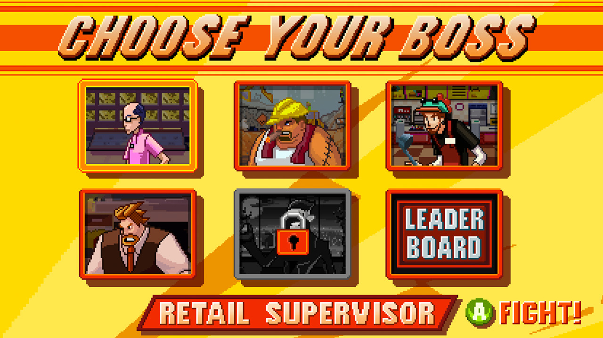
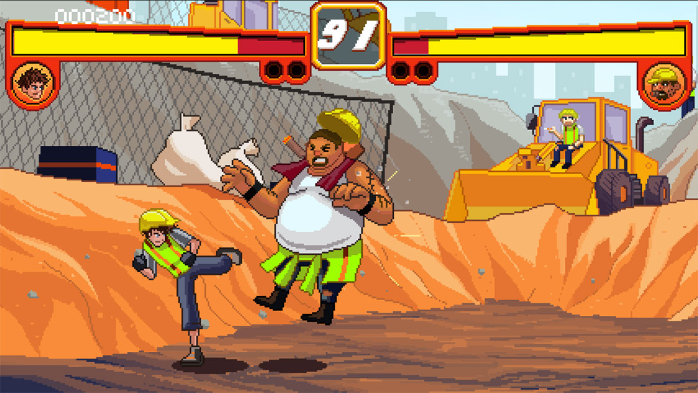

## *A 2D fighter for Xbox 360, Xbox One and Web.*

 
The most ambitious mini-game I've worked on, Boss Beatdown is a game that spans three platforms, four input methods and two programming languages.

On this project the Xbox One (with the app running in HTML5) along with the Web were new, untamed beasts so the primary, base platform was the Xbox 360 as the workflow and tools were mature here &mdash; we had a powerful timeline-based animation and scene editor that was designed to work seamlessly with the Xbox 360. Everyone on the project knew how to use this tool so we wanted to keep it in place for all versions of the game.

Since the project targeted three platforms we looked to reuse as much work as possible. To avoid having to recreate art assets and scene files we reimplemented the engine and system APIs from Lua in Javascript. The resulting Javascript engine may seem a little odd to the average Javascript coder but it allowed assets to be copied and pasted between platforms with everything "just working".

The first pass of the Lua to Javascript porting process was accomplished by a switch statement and some regular expressions. Not the prettiest thing to look at it but it was easy, fast, consistent and got the code about 90% of the way ported. The last 10% was all manual. Fortunately Lua and Javascript both use prototype inheritance so they can be written in a similar manner using similar idioms.

The Xbox One version was the second version after the 360 one. It ran in an IE10 powered web view and had access to th Xbox gamepad. This version was a <code>canvas</code> based game using the exact same art, audio and scene files from the Xbox 360 version. Gamepad support was handled via an API provided by the Xbox.

The Web version of Boss Beatdown allowed us to really get on the bleeding edge of web technologies. No longer restricted by the requirement to support only IE10 we reimplemented our rendering system to use WebGL (<a href="http://www.pixijs.com/" title="pixi.js">thanks Pixi!</a>) with a fallback to <code>canvas</code> for browsers that lacked WebGL support. We also gave the audio system a boost by setting up Web Audio leaving the existing <code>audio</code> element system in place as a fallback.

One downside of the Web version of the game is the lack of a gamepad as the default input mechanism. For the Web version we implemented a "keyboard gamepad" &mdash; complete keyboard input that ahered to the game's gamepad API. This allowed us to swap keyboard for gamepad input with a simple <code>if/else</code>.

Of course, just because a gamepad isn't the default input device for a web browser doesn't mean we couldn't support it. <a href="https://developer.mozilla.org/en-US/docs/Web/API/Gamepad_API/Using_the_Gamepad_API" title="Gamepad API on MDN">The Gamepad API</a> allows the browser to talk with gamepads connected to the computer and we made use of this. While we continued to use the API from our Xbox One gamepad class the guts had to be completely reworked as the gamepad APIs for the Web and Xbox One were quite different. In fact, in classic webdev fashion we had to implement two versions of the Web gamepad API as there were competing APIs. Web development just wouldn't feel like actual work unless you had to implement the same feature at least twice to get acceptable browser coverage.

To manage all the porting and two Javascript versions of the game we wrote several tools using the Gulp task runner. These tools focused on automating as many things as possible, doing the first pass of Lua to Javascript porting, converting asset formats and managing the build process for each version of the game.
